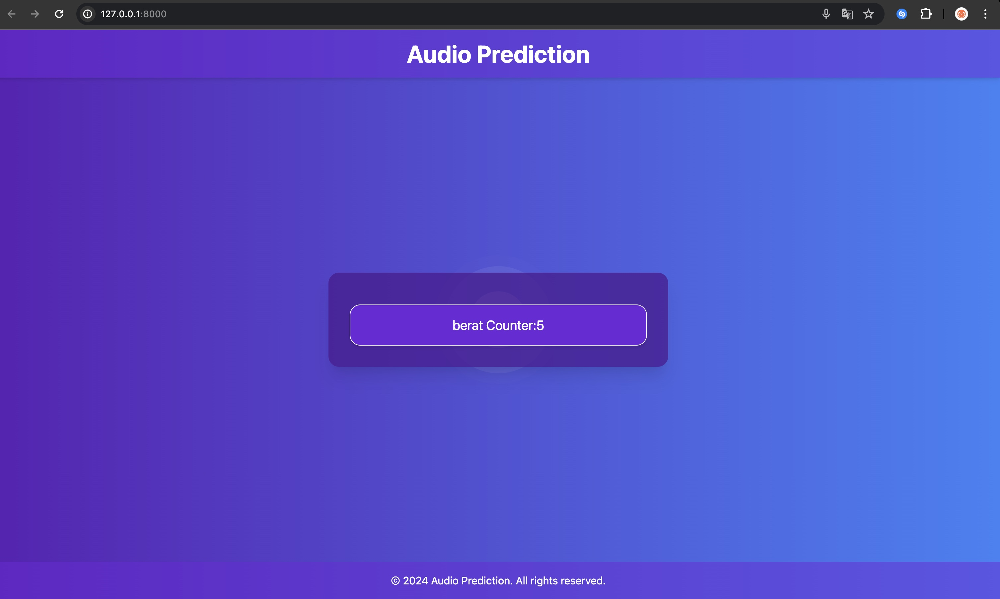

# End-to-End-Speaker-Recognition-ML

## Table of Contents

- [Introduction](#introduction)
- [Installation](#installation)
- [Usage](#usage)
- [Features](#features)
- [Contributing](#contributing)
- [License](#license)

## Introduction

The End-to-End Speaker Recognition ML project is designed to recognize speakers using machine learning techniques. This project uses a Django backend and a basic JavaScript frontend. The machine learning model employed for speaker recognition is a Multi-Layer Perceptron (MLP).

An MLP is a type of neural network that consists of multiple layers of neurons. It includes an input layer, one or more hidden layers, and an output layer. Each neuron in one layer is connected to every neuron in the next layer, and these connections have weights that are learned during training. MLPs are commonly used for tasks like classification and regression.

## Installation

### Prerequisites

- Python 3.x
- Django
- scikit-learn
- numpy
- pandas

### Setup

1. Clone the repository:
    ```bash
    git clone https://github.com/your-username/End-to-End-Speaker-Recognition-ML.git
    cd End-to-End-Speaker-Recognition-ML
    ```

2. Create a virtual environment and activate it:
    ```bash
    python -m venv env
    source env/bin/activate  # On Windows use `env\Scripts\activate`
    ```

3. Install the required packages:
    ```bash
    pip install -r requirements.txt
    ```

4. Apply migrations and start the Django server:
    ```bash
    python manage.py migrate
    python manage.py runserver
    ```

5. Open your browser and navigate to `http://127.0.0.1:8000/` to see the application running.

## Usage

### Training the Model

To train the MLP model for speaker recognition, you can use the `TrainingModel.ipynb` notebook. It contains all the necessary steps to preprocess the data, train the model, and evaluate its performance.

1. Open the Jupyter notebook:
    ```bash
    jupyter notebook TrainingModel.ipynb
    ```

2. Follow the instructions in the notebook to train the model.

### Testing the Model

You can use the `test_audio.py` script to test the trained model with new audio samples.

1. Place your audio files in the appropriate directory.
2. Run the script:
    ```bash
    python test_audio.py
    ```

### Frontend Interface

Once the Django server is running, you can interact with the frontend to record your voice and get predictions.



## Features

- **Speaker Recognition**: Identify speakers from audio samples using an MLP model.
- **Django Backend**: Manage the backend logic and database with Django.
- **JavaScript Frontend**: Simple frontend to interact with the model.

## Contributing

We welcome contributions to improve this project! Here are some ways you can contribute:

- Report bugs and suggest features via [GitHub Issues](https://github.com/your-username/End-to-End-Speaker-Recognition-ML/issues).
- Submit pull requests for new features, bug fixes, or improvements.
- Improve documentation and examples.

Please follow the [Contributor Covenant Code of Conduct](https://www.contributor-covenant.org/version/2/0/code_of_conduct/) in all your interactions with the project.

